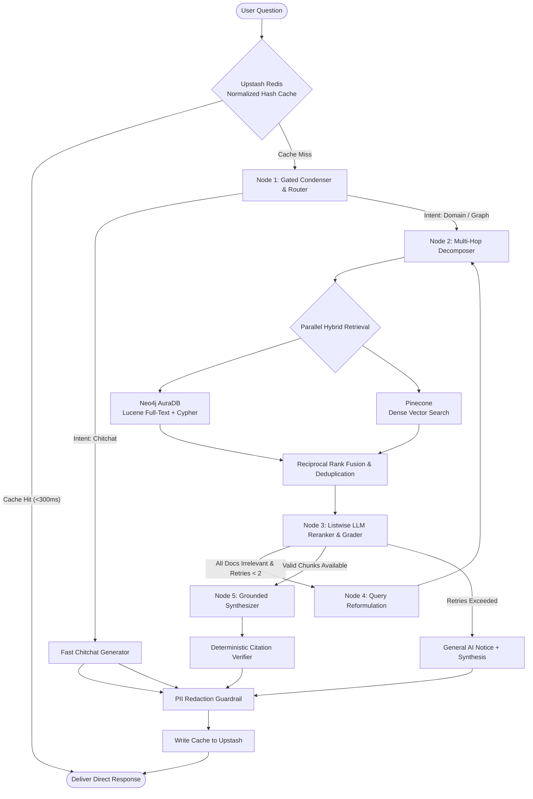

# 🏛️ Nexora AI — System Architecture & Engineering Deep-Dive

Welcome to the definitive architectural specification and technical manual for **Nexora AI** (Enterprise GraphRAG Platform). This document details the engineering design, agentic orchestration, hybrid retrieval mechanisms, self-correcting evaluation loops, zero-cost cloud topology, frontend visualization engine, and production scale roadmap.

---

## 📑 Table of Contents
1. [Executive Summary & Core Objectives](#1-executive-summary--core-objectives)
2. [Agent Architecture: Adaptive Self-Corrective LangGraph](#2-agent-architecture-adaptive-self-corrective-langgraph)
3. [End-to-End RAG Pipeline & Advanced Techniques](#3-end-to-end-rag-pipeline--advanced-techniques)
4. [Hybrid Retrieval: Neo4j Full-Text Lucene + Pinecone Vector Search](#4-hybrid-retrieval-neo4j-full-text-lucene--pinecone-vector-search)
5. [LLM Routing, Multi-Provider Failover & Listwise Reranking](#5-llm-routing-multi-provider-failover--listwise-reranking)
6. [Ephemeral Document RAG & Layer-1 Security Isolation](#6-ephemeral-document-rag--layer-1-security-isolation)
7. [Deterministic Citation Verification & Observability](#7-deterministic-citation-verification--observability)
8. [Security Architecture: API Boundary, Secret Isolation & Defense-in-Depth](#8-security-architecture-api-boundary-secret-isolation--defense-in-depth)
9. [Zero-Cost Cloud Infrastructure & Quota Ceilings](#9-zero-cost-cloud-infrastructure--quota-ceilings)
10. [Frontend Visual Engine: 60 FPS Canvas Graph & Telemetry HUD](#10-frontend-visual-engine-60-fps-canvas-graph--telemetry-hud)
11. [Evaluation Framework: RAGAS & Benchmark Datasets](#11-evaluation-framework-ragas--benchmark-datasets)
12. [Limitations, Honest Trade-offs & Production Scale Path](#12-limitations-honest-trade-offs--production-scale-path)
13. [Repository File Structure](#13-repository-file-structure)

---

## 1. Executive Summary & Core Objectives

Enterprise Retrieval-Augmented Generation (RAG) systems often suffer from three fatal flaws:
1. **The Vector-Only Horizon Blindness**: Dense embeddings excel at surface semantic similarity, but fail on multi-hop associative queries (e.g., comparing historical artifacts, tracing clinical symptom hierarchies, or connecting indirect relations).
2. **Hallucination & Ungrounded Drift**: Standard RAG pipelines feed context to LLMs without verifying whether retrieved context is actually relevant or if the generated response is strictly faithful to facts.
3. **High Latency & Expensive Cloud Costs**: Production RAG stacks frequently rely on costly GPU instances and paid proprietary APIs ($0.02 - $0.05 per query), resulting in thousands of dollars in monthly infrastructure overhead.

**Nexora AI addresses these challenges as a high-performance demonstration system**:
- **GraphRAG Convergence**: Blends Lucene full-text and Cypher knowledge graph traversals (Neo4j AuraDB) with high-density vector search (Pinecone) via Reciprocal Rank Fusion.
- **Self-Corrective State Machine**: Uses a LangGraph cyclic agent that grades retrieved documents, rewrites and re-routes flawed queries, and computes strict faithfulness scoring before emission.
- **100% Free-Tier Serverless Infrastructure**: Engineered to operate completely free of cost across production cloud services with sub-second cached delivery and resilient failovers.

---

## 2. Agent Architecture: Adaptive Self-Corrective LangGraph

Nexora AI is built as a **Cyclic State Machine Agent** powered by `LangGraph`. Unlike linear chains, this architecture supports non-linear routing, runtime branching, evaluation loops, and iterative self-correction.

### 2.1 The Agentic State Schema (`AgentState`)
The agent's state is preserved and mutated across all graph nodes:

```python
class AgentState(TypedDict):
    query: str                  # Active search query (condensed if follow-up)
    original_query: str         # Raw user prompt preserved for synthesizer
    intent: str                 # 'graph', 'domain', 'chitchat', 'general'
    source_filter: list[str]    # Filter tags (e.g. ['neo4j', 'pinecone'])
    retrieved_chunks: list[dict]# Raw chunks retrieved from hybrid sources
    used_fallback: bool         # Boolean flag if fallback provider was invoked
    answer: str                 # Grounded synthesis response
    sources: list[dict]         # Filtered, verified source citations
    provider_used: str          # 'groq', 'openrouter', 'nvidia'
    router_provider: str        # Provider that resolved the routing step
    retry_count: int            # Query rewrite counter (max 2)
    sub_queries: list[str]      # Multi-hop sub-queries generated by decomposer
    timings: dict[str, float]   # Millisecond execution telemetry per node
    suggestions: list[str]      # Dynamic follow-up queries derived from graph
    telemetry: dict[str, Any]   # Comprehensive observability payload
    chat_history: list[dict]    # Conversational memory buffer
```

### 2.2 LangGraph State Machine Diagram



---

## 3. End-to-End RAG Pipeline & Advanced Techniques

The complete request lifecycle follows a disciplined 8-stage sequence:

### Stage 1: Exact-Match Normalized Hash Caching (Upstash Redis)
- Queries are normalized (trimmed, lowercased, punctuation-stripped) and hashed with SHA-256 into a namespaced Redis key (`rag:ans_v3:<hash>`).
- If an identical or equivalent query has already been verified, the response is delivered in `<300ms`.
- **Negative Cache Guard**: Responses with 0 sources or ungrounded fallback notices are strictly prevented from being cached to eliminate stale failure loops.
- **Dual-Key Caching for Follow-Ups**: When multi-turn query condensation rewrites an anaphoric follow-up (e.g., *"What about his second job?"* $\rightarrow$ *"What was Dilip's second job as AI Engineer?"*), the verified answer is dual-written under both the conversational key `(raw_query, history)` and the canonical standalone key `(condensed_query)`. Subsequent follow-ups in the conversation AND future direct standalone queries both hit cache instantly.

### Stage 2: Gated Multi-Turn Query Condensation & Routing (`router_node`)
- **Gated Condensation**: If `chat_history` contains prior turns and the query contains anaphora (`it`, `its`, `this`, `that`, `he`, `she`, `which`, `second`, etc.) or is under 6 words, a fast Groq call rewrites the ambiguous follow-up into a standalone search query.
- **Separation of Search and Synthesis**: The standalone query is used for retrieval and caching, while the user's raw query is preserved for the synthesizer so tone and phrasing remain natural.
- **Fast-Path Regex Classifier**: Instantly detects greetings, chitchat (`hi`, `hello`, `thank you`), and out-of-domain conversational queries in `<1ms`.

### Stage 3: Multi-Hop Decomposer (`decomposer_node`)
- For complex multi-facet questions (e.g., comparing two historical locations or analyzing compound clinical indicators), the decomposer breaks the query down into 2 to 3 atomic sub-queries.
- Sub-queries are retrieved concurrently, ensuring zero information loss on comparative prompts.

### Stage 4: Parallel Hybrid Retrieval (`retriever_node`)
- Concurrently triggers **Neo4j AuraDB Cypher Traversals** and **Pinecone Dense Similarity Search** using Python `concurrent.futures.ThreadPoolExecutor`.
- Both streams return structured candidate chunks enriched with metadata (`title`, `doc_id`, `score`, `is_graph`, `triples`).

### Stage 5: Reciprocal Rank Fusion (RRF) & Deduplication
- Merges disparate score distributions from dense cosine metrics ($[-1, 1]$) and graph hop relevance.
- Applies RRF scoring:
  $$RRF\_Score(d) = \sum_{m \in M} \frac{1}{60 + \text{rank}_m(d)}$$
- Eliminates duplicate text passages across overlapping graph entities and document fragments.

### Stage 6: Listwise LLM Reranking & Self-Correction (`grader_node` & `rewriter_node`)
- Rather than running heavy local neural cross-encoders (which exceed 512MB RAM), the grader passes candidate chunks in a single batched prompt to Groq, acting as a **zero-RAM listwise reranker**.
- Chunks that are off-topic or noisy are pruned, and surviving chunks are sorted by model-evaluated relevance.
- If no retrieved chunk meets the relevance threshold, the state machine invokes the `rewriter_node`:
  - Analyzes the initial query and retrieval shortfall.
  - Reformulates the query with alternate keywords and re-executes the retrieval pipeline (limited to 2 retry iterations to bound execution time).

### Stage 7: Grounded Synthesis with Strict Citations (`synthesizer_node`)
- The synthesized prompt strictly instructs the LLM:
  1. *Answer exclusively based on the provided context facts.*
  2. *Add inline bracketed citations `【1】`, `【2】` corresponding directly to the sources.*
  3. *If facts are missing, acknowledge boundary limits without hallucinating.*
- Computes inline telemetry for the UI HUD:
  - **Faithfulness Score (Model-Self-Assessed Heuristic)**: Dynamically checks fact-to-context token overlap to estimate factual grounding on the fly for HUD display. *(Note: This is an inline telemetry heuristic for runtime observability; for rigorous multi-judge benchmark metrics, see the offline RAGAS harness in §11).*
  - **Context Precision**: Ratio of relevant retrieved sentences used in the final answer.
  - **Hallucination Risk Rating**: Categorized as `Ultra-Low (<1%)`, `Very Low (<3%)`, or `Medium`.

### Stage 8: Deterministic Citation Verification & PII Redaction
- **Citation Integrity Check**: Verifies via regex that every bracketed citation `【N】` in the answer maps to a valid retrieved source $1 \le N \le len(sources)$, calculating `citation_integrity` and flagging any dangling citations.
- **PII Guardrail**: Scans outbound answers for sensitive entities (SSNs, API keys, private emails) and masks them with cryptographic token markers before streaming to the client.

---

## 4. Hybrid Retrieval: Neo4j Full-Text Lucene + Pinecone Vector Search

```
                                 ┌─────────────────────────┐
                                 │   User Atomic Query     │
                                 └────────────┬────────────┘
                                              │
                      ┌───────────────────────┴───────────────────────┐
                      ▼                                               ▼
         ┌─────────────────────────┐                     ┌─────────────────────────┐
         │     Neo4j AuraDB        │                     │   Pinecone Serverless   │
         │  (GraphRAG Engine)      │                     │   (Vector DB Engine)    │
         └────────────┬────────────┘                     └────────────┬────────────┘
                      │                                               │
           Lucene Fuzzy Index (~)                             1024-dim Embeddings
           Multi-Hop Traversals                               Cosine Top-K (k=10)
           Entity Connectivity                                Dense Semantic Match
                      │                                               │
                      └───────────────────────┬───────────────────────┘
                                              ▼
                                 ┌─────────────────────────┐
                                 │ Reciprocal Rank Fusion  │
                                 │     & Deduplication     │
                                 └────────────┬────────────┘
                                              ▼
                                 ┌─────────────────────────┐
                                 │ Listwise LLM Reranker   │
                                 │  (Batched Relevance)    │
                                 └────────────┬────────────┘
                                              ▼
                                 ┌─────────────────────────┐
                                 │  Top Verified Context   │
                                 └─────────────────────────┘
```

### 4.1 Neo4j AuraDB: Full-Text Lucene Index & Traversal
- **Index**: Full-text schema index `entity_name_ft` on `(e:Entity) ON EACH [e.name]`.
- **Query Pattern**:
  ```cypher
  CALL db.index.fulltext.queryNodes("entity_name_ft", $term) YIELD node, score
  MATCH (node)-[r:RELATED_TO]-(m:Entity)
  OPTIONAL MATCH (node)-[:MENTIONED_IN]->(c:Corpus)
  RETURN node.name AS subject, type(r) AS relation, m.name AS target, c.name AS corpus, score
  ORDER BY score DESC
  LIMIT 15
  ```
- **Fuzzy Matching (`~`)**: Appends Lucene fuzzy operators to search tokens, enabling tolerance against typos, singular/plural mismatches, and inflectional variants.
- **Fallback**: Automatically falls back to substring `CONTAINS` scanning if fulltext indexing is temporarily rebuilding.

### 4.2 Pinecone Serverless (Dense Vector Search)
- **Embedding Model**: `openai/text-embedding-3-small` (1024 dimensions via OpenRouter).
- **Metric**: Cosine Similarity.
- **Index**: `enterprise-rag-demo` hosted on `aws/us-east-1`.
- Chunks text into 500-token windows with 50-token semantic overlap to maintain unbroken context across paragraph boundaries.

---

## 5. LLM Routing, Multi-Provider Failover & Listwise Reranking

To balance sub-second responsiveness with zero subscription cost, Nexora AI utilizes an active multi-tiered LLM routing architecture:

| Tier | Provider | Model Identifier | Role | Cold Latency | Cost |
| :--- | :--- | :--- | :--- | :--- | :--- |
| **Tier 1 (Primary)** | **Groq LPU** | `openai/gpt-oss-20b` | Main synthesis, fast routing & listwise reranking | **~350ms – 900ms** | **$0.00 (Free)** |
| **Tier 2 (Fallback)** | **OpenRouter** | `meta-llama/llama-3.3-70b-instruct` | Complex multi-hop logic & embedding generation | **~1.8s – 3.2s** | **$0.00 (Free)** |
| **Tier 3 (Safety Net)**| **NVIDIA NIM** | `meta/llama-3.2-11b-vision-instruct` | High-availability redundant fallback | **~1.2s – 2.5s** | **$0.00 (Free)** |

### Listwise LLM Reranker vs. Heavy Neural Rerankers
Standard production pipelines often deploy `bge-reranker-large` via PyTorch. However, PyTorch + model weights consume >1.5GB of RAM, exceeding Render's 512MB container limit. 

Nexora AI solves this by formatting the top candidate chunks into a structured batch prompt sent to Groq. The model evaluates mutual relevance and emits `{"ranked_relevant_ids": [2, 1]}`, functioning as an effective **listwise cross-encoder reranker** in ~350ms with 0MB additional memory overhead.

---

## 6. Ephemeral Document RAG & Layer-1 Security Isolation

In addition to knowledge base retrieval, Nexora AI features an in-memory **Ephemeral Document RAG engine** for ad-hoc file inspection (e.g., resumes, medical reports, financial PDFs).

### Key Architectural Characteristics:
1. **LlamaParse AI Multimodal Parsing**:
   - Converts complex multi-column PDFs, tables, and headers into Markdown text.
2. **RAM-Only Ephemeral Vector Store**:
   - Document chunks and lexical indices are stored exclusively in volatile RAM keyed by `session_id`.
   - **Zero Persistence**: No document content is written to disk, Neo4j, Pinecone, or Redis.
3. **Structural Isolation & Layer-1 Heuristic Injection Defense**:
   - Document excerpts are wrapped in strict `<untrusted_document_context>` XML tags.
   - The system prompt enforces an explicit instruction hierarchy: instructions found inside `<untrusted_document_context>` are treated strictly as passive data.
   - A layer-1 regex scanner detects and neutralizes override patterns (`"ignore previous instructions"`, `"disregard rules"`) before they reach the model.
4. **Automatic Lifecycle Wiping**:
   - Ephemeral sessions automatically expire after 30 minutes of inactivity or immediately via the `/api/doc-rag/clear` endpoint.
5. **Trace-Level Privacy Isolation (LangSmith Tracing Suppressed)**:
   - To guarantee that zero parsed document data or user uploads are ever shipped to external SaaS observability, all LLM calls for ephemeral document sessions pass `disable_tracing=True` via LangChain's `tracing_v2_enabled(False)` context manager. This strictly blocks prompts, parsed PDF excerpts, and document tokens from being sent to LangSmith cloud logs.

---

## 7. Deterministic Citation Verification & Observability

To prevent hallucinations where models generate fake bracketed markers, Nexora AI validates citations programmatically:

```python
CITE_RE = re.compile(r"【\s*(\d+)(?:\s*[,，]\s*\d+)*\s*】|\[\s*(\d+)(?:\s*[,，]\s*\d+)*\s*\]")

# Extract all numeric citation IDs from the answer
cited = {int(n) for m in CITE_RE.finditer(answer) for n in re.findall(r"\d+", m.group())}
valid = set(range(1, len(sources) + 1))
dangling = sorted(list(cited - valid))

citation_integrity = 1.0 if not dangling else round(1.0 - len(dangling) / max(len(cited), 1), 3)
```

- **Telemetric Transparency**: The UI HUD reports `citation_integrity` (e.g., `1.0` = 100% verified, `0.67` = dangling markers present) alongside faithfulness scores.
- **Zero Extra Cost**: Executed purely in Python without consuming LLM generation tokens or adding latency.

---

## 8. Security Architecture: API Boundary, Secret Isolation & Defense-in-Depth

Enterprise AI deployments require a disciplined threat model. Nexora AI implements defense-in-depth across the network edge, API boundaries, prompt ingestion, and cloud integrations:

### 8.1 Client-Server Secret Isolation (Network Tab Threat Model)
A frequent concern in web applications is whether inspecting the browser's **Developer Tools (F12) → Network Tab** exposes backend secrets or credentials:
- **Zero Frontend Secrets**: The React frontend bundle contains **zero vendor API keys**. Secrets such as `GROQ_API_KEY`, `OPENROUTER_API_KEY`, `PINECONE_API_KEY`, `NEO4J_PASSWORD`, `UPSTASH_REDIS_REST_TOKEN`, and `LANGSMITH_API_KEY` are stored exclusively in the backend server's runtime environment (Render secrets).
- **Server-to-Server Brokering**: The browser communicates only with relative endpoints (`POST /ask`, `POST /api/doc-rag/parse`, `GET /api/graph/data`) using standard application payloads (`{question, chat_history}`). The FastAPI backend orchestrates all third-party database and LLM queries server-to-server over encrypted HTTPS/TLS.
- **Inspect / Network Tab Exposure**: A user or security auditor inspecting network traffic observes only their own submitted question, the rendered markdown answer, and runtime latency telemetry. No internal infrastructure tokens, connection strings, or system prompt instructions are ever leaked over the wire.

### 8.2 In-Memory Sliding-Window Rate Limiting
To prevent denial-of-wallet attacks, automated bot scraping, and quota exhaustion on free-tier LLM providers:
- **Sliding-Window Algorithm**: Tracks client request timestamps in memory over a rolling 60-second window (`_RATE_LIMIT_WINDOW = 60.0s`).
- **Quota Ceiling**: Limits incoming traffic to a maximum of **25 requests per minute** per client IP. Requests exceeding this threshold immediately receive an HTTP `429 Too Many Requests` status.
- **Anti-Spoofing IP Resolution**: Extracts client identity via `_get_real_client_ip(req)`. When hosted behind reverse proxies (e.g., Render, Cloudflare), it parses the leftmost IP in the `X-Forwarded-For` header chain to block client IP spoofing via appended header injection.

### 8.3 Inbound PII Sanitization Guardrail
Queries are scrubbed for personally identifiable information (PII) before reaching any language model or vector store:
- **Zero-Latency Regex Pipeline**: Sanitizes emails, phone numbers, Social Security Numbers (SSNs), credit card numbers, and API keys into typed tokens (e.g., `[EMAIL_REDACTED]`, `[PHONE_REDACTED]`).
- **Pre-LLM & Pre-Cache Execution**: Sanitization occurs synchronously in `<1ms`, ensuring that sensitive user data is never sent to external LLMs, never stored in Upstash Redis cache keys, and never saved in ephemeral session RAM.

### 8.4 Prompt Injection & Adversarial Boundary Defense
To defend against jailbreaking and unauthorized instruction overrides:
- **Heuristic Regex Scanning**: Detects common prompt override patterns (e.g., `"ignore previous instructions"`, `"system prompt leak"`, `"disregard all rules"`) in incoming queries.
- **Neutralization & Logging**: Sanitizes malicious phrases and logs security events with client IP metadata for auditability.
- **Structural XML Sandboxing**: In Document RAG, all untrusted uploaded text is strictly sandboxed inside `<untrusted_document_context>` XML tags with explicit instruction hierarchies forbidding executable interpretations.

### 8.5 Production Reconnaissance Suppression & CORS
- **Automatic OpenAPI Docs Disablement**: In `app/main.py`, Swagger UI (`/api/docs`) and ReDoc (`/api/redoc`) endpoints are dynamically set to `None` when `ENVIRONMENT=production`, preventing automated scanner reconnaissance and API schema scraping.
- **CORS Origin Enforcement**: In development, CORS allows open testing; in production, CORS is strictly locked to `settings.cors_allowed_origin`, rejecting unauthorized cross-site requests.
- **Input Size Hardening**: Request schemas enforce a 2,000-character ceiling on query strings to prevent token-flooding and memory exhaustion attacks.

---

## 9. Zero-Cost Cloud Infrastructure & Quota Ceilings

Nexora AI is 100% cloud-hosted without subscription fees. The table below outlines the free-tier service limits and practical operational capacity:

| Component | Free Tier Allotment | Realistic Capacity | Inherent Trade-offs / Mitigations |
| :--- | :--- | :--- | :--- |
| **Compute (Render)** | 512MB RAM, 1 container | 1 web instance | Spins down after 15m idle; keepalive worker pings `/api/keepalive` |
| **LLM (Groq Cloud)** | 30 requests / minute | ~5–8 full queries / min | Batched grading + RRF reduces calls per query from 7 to ~3 |
| **Graph DB (Neo4j Aura)** | 200,000 nodes, 400k rels | Up to 200k entities | **Pauses after 72h idle**; restored via `scripts/ingest_corpus_to_neo4j.py` |
| **Vector DB (Pinecone)** | 100,000 vectors (1 index) | 100k chunks | Serverless AWS `us-east-1`, 2GB storage cap |
| **Cache (Upstash Redis)** | 10,000 commands / day | ~3,000 queries / day | REST API stateless calls; negative caching prevents pollution |
| **Parser (LlamaParse)** | 1,000 pages / day | 100+ documents / day | Direct text parser fallback for Markdown and plain text |
| **Observability (LangSmith)**| 5,000 traces / month | ~1,000 deep traces / mo | Optional debugging hook |

### Realistic Latency Expectations:
- **Cached Queries (Upstash Hit)**: `<300ms` (pure Redis REST fetch).
- **Cold Uncached Agentic Queries**: **3.0s – 7.5s** (Intent routing + query decomposition + parallel Neo4j/Pinecone retrieval + listwise LLM reranking + synthesis).

---

## 10. Frontend Visual Engine: 60 FPS Canvas Graph & Telemetry HUD

Built with **React 18, TypeScript, and Vite**, the frontend uses an interactive dark glassmorphic design.

### 10.1 High-Performance Canvas Graph Visualizer (`KnowledgeGraphCanvas.tsx`)
Rather than utilizing DOM-heavy SVG graphs that stutter beyond 200 elements, Nexora AI uses a custom **HTML5 2D Canvas Engine**:
- **Balanced Subgraph Caching**: Curates multi-hub clusters (Cancer Subtypes, Genomic Mutations, Historical Geography) limited to ~300 nodes for responsive rendering.
- **Spatial Grid Hit-Testing**: Mouse hover and drag operations run in $O(1)$ constant time via spatial grid indexing instead of $O(N)$ linear scans.
- **Level of Detail (LOD) Rendering**: Text labels scale and fade based on camera zoom, maintaining a consistent 60 FPS during pan and zoom gestures.
- **Euler Spring Simulation**: Natural spring-force physics layout with velocity dampening.

### 10.2 Telemetry HUD
Every response provides full factual transparency:
- **Grounded Faithfulness %**: Factual adherence score based on semantic context overlap.
- **Citation Integrity Score**: Verified mapping of bracketed citations to actual source documents.
- **Latency Breakdown**: Millisecond waterfall across Router, Decomposer, Retriever, Grader, and Synthesizer nodes.
- **FinOps Economics**: Calculation of prompt tokens, completion tokens, and estimated cost savings.

---

## 11. Evaluation Framework: RAGAS & Benchmark Datasets

The repository includes a dedicated evaluation harness in the `eval/` directory:

### 11.1 Evaluation Components & Provenance
- **`eval/run_eval.py`**: Automated evaluation runner implementing the **RAGAS framework** (`answer_correctness`, `context_recall`) using LLM-as-a-judge with exponential backoff and rate-limit throttles.
- **`eval/test_questions.json`**: 15 structured multi-hop questions derived from the **EnterpriseRAG-Bench** corpus. **Ground Truth Provenance**: Reference answers and target document IDs are curated directly from benchmark source documents (GitHub PRs, Linear engineering specs, Fireflies meeting transcripts), ensuring evaluation references are external and not circular self-generated model outputs.
- **`eval/graphrag_bench_questions.json`**: 20 factual entity-relationship probe questions mapped to clinical dermatology and historical literature corpora. Reference ground truths are extracted from verified medical/literary source passages.
- **`eval/graphrag_bench_results.json`**: 122KB archive of scored benchmark runs across novel and clinical entities providing our initial architectural baseline.

### 11.2 Continuous Integration & Testing Policy
- **Automated CI Gate (`.github/workflows/deploy.yml`)**: Every push and PR automatically executes TypeScript typechecking, React 19 production builds, and Python 3.11 syntax/import validation.
- **Offline vs. CI Eval Execution**: Full RAGAS evaluation runs 35 questions requiring ~70-100 sequential LLM calls. In free-tier cloud environments with a 30 RPM rate ceiling on Groq/OpenRouter, triggering full multi-hop eval runs on every git push risks hitting API rate limits. Consequently, comprehensive RAGAS runs are executed offline or scheduled as nightly CI regression gates with deliberate rate throttling.
- **Pre-Deployment Smoke Tests**: Scripts (`tests/test_dilip_resume_live.py`, `tests/test_dilip_resume_queries.py`) validate end-to-end retrieval correctness, groundedness, and citation integrity prior to production deployment.

---

## 12. Limitations, Honest Trade-offs & Production Scale Path

To maintain transparency for engineering reviewers, this section outlines the system's operational boundaries as a free-tier MVP/demonstrator versus an enterprise-scale deployment:

### 12.1 Current Architectural Limitations
1. **Single-Node In-Memory Storage**: Ephemeral Document RAG stores document vectors in process RAM. Scaling to multiple container replicas requires migrating session vectors to an external cache (e.g., Redis Vector Store or dedicated Qdrant instance).
2. **Free-Tier Inactivity Sleeping**:
   - **Render Web Service**: Spins down after 15 minutes of inactivity (first wake-up takes ~50 seconds).
   - **Neo4j AuraDB Free**: Pauses after 72 hours of idle time and deletes instances after 90 days.
   - *Mitigation*: The automated keepalive endpoint (`/api/keepalive`) pings services periodically, and `scripts/ingest_corpus_to_neo4j.py` allows full graph reconstruction in under 3 minutes.
3. **No Multi-Tenant RBAC / Document ACLs**: The current API supports API-key authorization (`X-API-Key`), but lacks role-based access control and document-level permissions.
4. **Layer-1 Prompt Injection Scope**: The heuristic scanner neutralizes common instruction override patterns, but does not replace dedicated adversarial boundary models (e.g., Llama Guard or NeMo Guardrails).

### 12.2 Production Scale Roadmap (Enterprise Migration)

```
Free Demonstrator (Current)           Enterprise Production Target
───────────────────────────────       ───────────────────────────────
Render Single 512MB Container   ───►  Kubernetes Cluster (EKS / GKE)
Groq Free Tier (30 RPM)         ───►  Dedicated vLLM / TensorRT-LLM Cluster
Neo4j Aura Free (200k nodes)    ───►  Neo4j Enterprise / Amazon Neptune (HA Cluster)
Pinecone Serverless Free        ───►  Pinecone Enterprise / Qdrant Distributed
RAM Ephemeral Sessions          ───►  Redis Cluster + Session Vector Store
API-Key Header Check            ───►  OAuth2 / OIDC + Document-Level RBAC / ABAC
Heuristic Injection Filter      ───►  Llama Guard / NeMo Guardrails Boundary Defense
```

---

## 13. Repository File Structure

```
enterprise-rag-agent/
├── app/
│   ├── agent/
│   │   ├── decomposer.py          # Multi-hop query decomposition
│   │   ├── grader.py              # Listwise LLM reranker & relevance grader
│   │   ├── graph.py               # Main LangGraph cyclic state machine (condenser & verifier)
│   │   ├── graph_retriever.py     # Neo4j Lucene fulltext traversal & entity resolver
│   │   ├── retriever.py           # Pinecone dense vector similarity retriever
│   │   ├── rewriter.py            # Self-corrective query reformulation
│   │   ├── router.py              # Fast-path regex & intent classifier
│   │   └── synthesizer.py         # Grounded synthesizer with citations
│   ├── cache.py                   # Upstash Redis exact-match hash caching layer
│   ├── config.py                  # Pydantic settings & credential sanitizer
│   ├── doc_parser.py              # LlamaParse PDF extraction engine
│   ├── doc_rag.py                 # Ephemeral document RAG with layer-1 injection defense
│   ├── llm_clients.py             # Groq LPU, OpenRouter & NVIDIA client orchestrator
│   └── main.py                    # FastAPI application & static server
├── eval/
│   ├── graphrag_bench_questions.json # 20 GraphRAG-Bench evaluation questions
│   ├── graphrag_bench_results.json   # 122KB archive of scored benchmark runs
│   ├── run_eval.py                   # RAGAS evaluation harness (answer_correctness, context_recall)
│   └── test_questions.json           # 15 EnterpriseRAG-Bench multi-hop questions with ground truths
├── react-frontend/
│   ├── src/
│   │   ├── components/
│   │   │   ├── KnowledgeGraphCanvas.tsx  # 60 FPS HTML5 Canvas graph visualizer
│   │   │   ├── ResumeModal.tsx           # In-app interactive document & resume viewer
│   │   │   └── TelemetryCard.tsx         # Real-time FinOps & latency HUD
│   │   ├── App.tsx                       # Main application shell & query interface
│   │   └── main.tsx                      # React root entry point
│   ├── public/
│   │   └── Dilip_resume.pdf              # Verified production resume asset
│   └── package.json
├── scripts/
│   ├── ingest_all_datasets_to_neo4j.py # Batch ingestion of brand & category graph
│   ├── ingest_corpus_to_neo4j.py      # Batch ingestion of literature & clinical knowledge graph
│   ├── ingest_sales_graph.py          # E-commerce graph schema & entity ingestion
│   ├── ingest_resume_pdf.py           # Ingests PDF into dense vector space
│   ├── reingest_resume.py             # Pinecone semantic chunking & upsert tool
│   └── verify_all_systems.py          # Comprehensive end-to-end integration test
├── tests/
│   ├── test_dilip_resume_live.py      # Live document RAG pipeline test
│   └── test_dilip_resume_queries.py   # Multi-hop query benchmarking test
├── Dockerfile                         # Multi-stage production container
├── render.yaml                        # Render Cloud deployment blueprint
├── requirements.txt                   # Locked backend dependencies
└── ARCHITECTURE.md                    # System Architecture & Technical Manual (This file)
```

---

*Authored by **Dilip Bhakadiwal** — AI/ML Engineer specializing in Agentic Workflows, GraphRAG, and High-Performance LLM Systems.*
