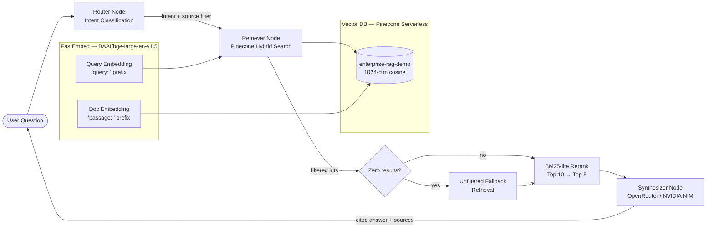

# Enterprise RAG Demo

> **Agentic retrieval-augmented generation over enterprise communication data** — answers questions grounded in Slack, GitHub, Jira, Confluence, Gmail and more, with per-claim source citations and intelligent conflict resolution.

🔴 **[Live Demo →](https://huggingface.co/spaces/YOUR_USERNAME/enterprise-rag)**
*(Free-tier hosting — if the demo hasn't been visited recently, the first load may take ~60 seconds to wake up. Please wait.)*

---

## Architecture



---

## Stack

| Layer | Tool | Notes |
|---|---|---|
| Dataset | EnterpriseRAG-Bench (local) | ~1,500 sampled docs from 9 enterprise platforms |
| Embeddings | FastEmbed `BAAI/bge-large-en-v1.5` | 1024-dim, CPU, no GPU needed |
| Vector DB | Pinecone Serverless (free tier) | Cosine similarity, metadata filtering |
| LLM primary | OpenRouter — Llama 3.3 70B Instruct | Free tier |
| LLM fallback | NVIDIA NIM — Llama 3.3 Nemotron 49B | Auto-switches on 429/timeout |
| Orchestration | LangGraph StateGraph | Router → Retriever → Synthesizer |
| Backend | FastAPI | `/ask`, `/health` endpoints |
| Frontend | Vanilla HTML/CSS/JS | Premium dark glassmorphism UI |
| Containerization | Docker | FastEmbed model baked at build time |
| CI/CD | GitHub Actions → HF Spaces | Eval gate blocks failing deploys |

---

## Why ~1,500 Docs?

The full EnterpriseRAG-Bench has ~500K documents. Scaling is straightforward — this demo is intentionally scoped to 1,500 for two reasons:

1. **Pinecone Starter tier** gives 2GB storage; 1,500 × 1024-dim vectors is ~25MB — tiny fraction of the limit.
2. **Demonstrating judgement**: a real engineering decision is knowing when a complete dataset isn't necessary to prove a concept. The retrieval quality, conflict resolution logic, and agent architecture are all fully exercised at this scale.

---

## Standout Feature: Conflict Resolution

When the knowledge base contains contradictory information (e.g., Slack says Friday, Confluence says Saturday), the synthesizer node uses a **source authority hierarchy**:

```
Confluence / official docs (10)
→ Notion / Drive / SharePoint (8-9)
→ GitHub (7)
→ Jira (6)
→ Teams / Discord (4-5)
→ Slack (3)
→ Gmail / Email (2)
```

Higher-authority sources win. When authority is equal, the more recent timestamp wins. Conflicts are surfaced explicitly in the answer — the system never silently picks one.

---

## Retrieval Design

```
User query
  ↓
Router: classify intent → basic / project_related / conflicting_info
  ↓
Intent → source filter:
  project_related  → filter source_type IN [jira, github, confluence]
  conflicting_info → no filter (search all)
  basic            → no filter
  ↓
Pinecone semantic search (top-10)
  ↓
Zero results with filter? → retry WITHOUT filter (logged as fallback)
  ↓
BM25-lite rerank: 80% semantic + 20% keyword overlap → top-5
  ↓
Synthesizer: prompt with context + citation rules
```

---

## Local Setup

```bash
# 1. Clone
git clone https://github.com/YOUR_USERNAME/enterprise-rag
cd enterprise-rag

# 2. Create virtual environment
python -m venv venv && source venv/bin/activate  # Windows: venv\Scripts\activate

# 3. Install dependencies
pip install -r requirements.txt

# 4. Configure environment
cp .env.example .env
# Edit .env with your API keys (Pinecone, OpenRouter, NVIDIA NIM)

# 5. Run data ingestion (first time only)
#    This embeds ~1,500 docs and upserts to Pinecone (~10-20 min)
python -m app.ingestion.embed_and_upsert

# 6. Test the agent directly
python -m app.agent.graph "What is the deployment process?"

# 7. Start the API server
uvicorn app.main:app --reload --port 8000

# 8. Open the UI
# Navigate to http://localhost:8000
```

### Docker

```bash
docker build -t enterprise-rag .
docker run -p 7860:7860 --env-file .env enterprise-rag
# → http://localhost:7860
```

---

## Evaluation

The pipeline is evaluated against 15 fixed Q&A pairs covering all three intents:

| Intent | Questions | Description |
|---|---|---|
| `basic` | 6 | Factual, policy, how-to |
| `project_related` | 5 | Code, tickets, sprints |
| `conflicting_info` | 4 | Contradictory sources |

```bash
# Run eval (sequential, rate-limit safe)
python eval/run_eval.py

# Results in eval/results.json
```

| Metric | Score |
|---|---|
| Avg composite score | TBD (run after ingestion) |
| Threshold (CI gate) | 0.60 |

---

## CI/CD

On every push to `main`:
1. **Evaluate** — runs `eval/run_eval.py`, fails if avg score < 0.6
2. **Deploy** — if eval passes, force-pushes to HF Spaces which rebuilds the Docker container

A scheduled ping runs every 36 hours to keep the Space from sleeping.

Required GitHub Secrets:
- `OPENROUTER_API_KEY`
- `NVIDIA_API_KEY`
- `PINECONE_API_KEY`
- `HF_TOKEN` (HF write-scope token)
- `HF_SPACE_ID` (e.g. `yourname/enterprise-rag`)
- `HF_SPACE_URL` (e.g. `https://yourname-enterprise-rag.hf.space`)

---

## Engineering Notes

- **Cold start** on HF Spaces: FastEmbed model baked into Docker image — no download on container start
- **Rate limits**: OpenRouter free tier → NVIDIA NIM fallback on 429/timeout; eval runs sequentially with 3s delays
- **Source deduplication**: chunked docs can produce multiple top-5 hits from the same `doc_id` — deduplicated before returning sources to the UI
- **Seed-first sampling**: eval ground-truth `doc_id`s are guaranteed to be in the Pinecone index (seeded before random sampling)

---

*Built for portfolio demonstration. Zero budget. Full CI/CD. Production-quality architecture.*
