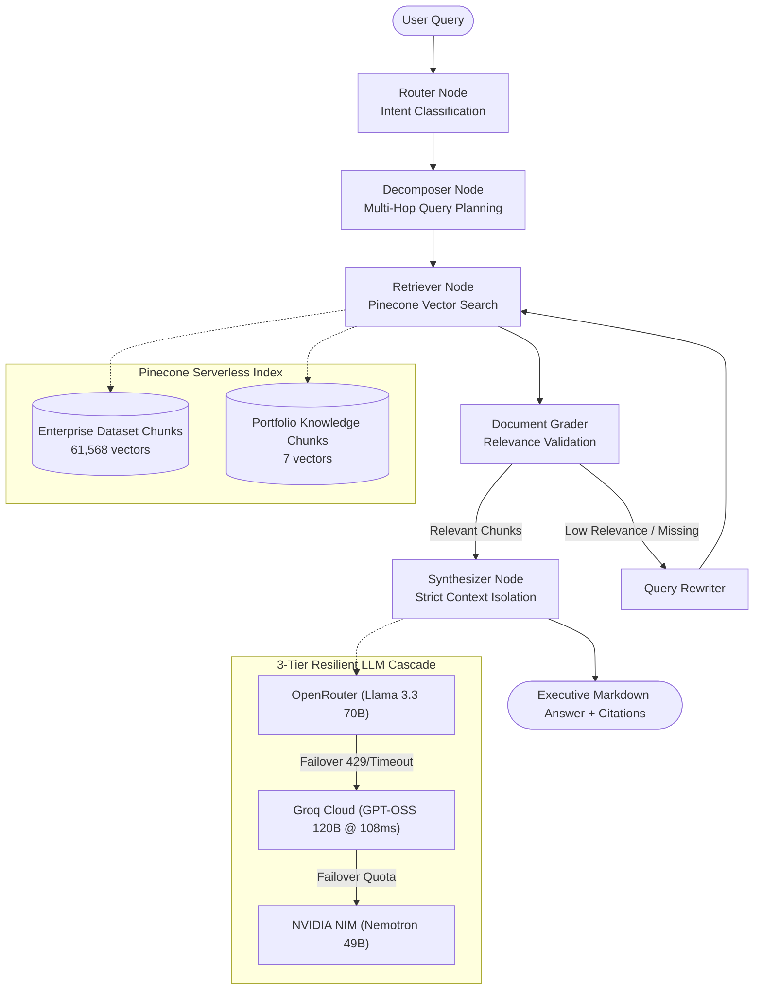

# 🏛️ Dilip Bhakadiwal — Enterprise RAG & Portfolio Application

> **Production-Grade Agentic RAG System & High-Performance Interactive Portfolio**
> Grounded semantic search over enterprise communication data (Slack, GitHub, Jira, Confluence, Gmail) and Dilip Bhakadiwal's complete engineering knowledge base, with per-claim source citations, zero-hallucination verification, and multi-tier LLM failover.

---

## 🚀 Key Highlights & Architectural Features



---

## 🛠️ Technology Stack

| Component | Technology | Highlights |
|---|---|---|
| **Frontend** | React 19, TypeScript, Tailwind CSS, Motion | Modern glassmorphic dark theme, animated background video, responsive mobile UI |
| **Backend** | FastAPI (Python 3.11+), AsyncIO, Uvicorn | Single-server architecture serving both React bundle and RAG APIs |
| **Vector DB** | Pinecone Serverless (AWS `us-east-1`) | 1024-dim cosine index with hybrid search and metadata filtering |
| **Embedding** | NVIDIA NIM `nvidia/nv-embedqa-e5-v5` | High-dimensional enterprise retrieval embeddings |
| **LLM Tier 1** | OpenRouter (`meta-llama/llama-3.3-70b-instruct`) | Primary reasoning and answer generation |
| **LLM Tier 2** | Groq Cloud (`openai/gpt-oss-120b`) | Ultra-fast secondary failover (108ms latency) |
| **LLM Tier 3** | NVIDIA NIM (`nvidia/llama-3.3-nemotron-super-49b-v1`) | Resilient tertiary fallback |
| **Agent Core** | LangGraph Stateful Cyclic Graphs | Router, Multi-hop Decomposer, Grader, Rewriter, Synthesizer |
| **Security** | Sliding Window Rate Limiting, XML Isolation | IP rate limiting (25 req/min), prompt injection isolation |

---

## 📁 Clean Repository Structure

```
.
├── app/
│   ├── agent/
│   │   ├── decomposer.py     # Multi-hop query decomposition
│   │   ├── grader.py         # Document relevance grading
│   │   ├── graph.py          # Compiled LangGraph workflow
│   │   ├── rewriter.py       # Query expansion and rewriting
│   │   ├── router.py         # Intent classification & source filtering
│   │   └── synthesizer.py    # Answer synthesis with XML context isolation
│   ├── ingestion/
│   │   ├── chunker.py        # Recursive token chunking
│   │   ├── embed_and_upsert.py # Batch ingestion to Pinecone
│   │   └── load_dataset.py   # Parquet enterprise dataset parser
│   ├── config.py             # Central Pydantic Settings
│   ├── llm_clients.py        # 3-tier failover (OpenRouter → Groq → NVIDIA)
│   └── main.py               # FastAPI entry point + Static React mount
│
├── react-frontend/
│   ├── public/               # Public assets (logo, video, PDF resume)
│   ├── src/
│   │   ├── assets/           # Bundled static image assets
│   │   ├── components/       # UI components (Hero, Navbar, RagChat, Modals)
│   │   ├── services/         # API integration client with graceful fallbacks
│   │   ├── App.tsx           # Main application shell
│   │   └── index.css         # Custom tokens & glassmorphism styling
│   ├── package.json          # Frontend dependencies
│   └── vite.config.ts        # Vite build & development proxy setup
│
├── scripts/
│   ├── fetch_langsmith_report.py  # LangSmith telemetry report generator
│   ├── generate_eval_questions.py # Benchmark evaluation question builder
│   ├── ingest_portfolio.py        # Portfolio vectors ingestion to Pinecone
│   └── test_with_questions.py     # Batch evaluation runner
│
├── .dockerignore             # Docker build exclusions
├── .gitignore                # Git secret & build exclusions
├── Dockerfile                # Multi-stage production build (Node + Python)
├── requirements.txt          # Python dependencies
├── start.bat                 # One-click Windows development launcher
└── README.md                 # Project documentation
```

---

## 🚀 Quick Start (Local Development)

### 1. Prerequisites
- Python 3.11+
- Node.js 20+

### 2. Configure Environment (`.env`)
Create a `.env` file in the project root:
```env
OPENROUTER_API_KEY=your_openrouter_api_key
GROQ_API_KEY=your_groq_api_key
NVIDIA_API_KEY=your_nvidia_api_key
PINECONE_API_KEY=your_pinecone_api_key
PINECONE_INDEX_NAME=enterprise-rag-demo
```

### 3. Start the Server (One Command)
Run the automated launcher:
```bat
start.bat
```
Or manually:
```bash
# Build the React frontend
cd react-frontend
npm install && npm run build
cd ..

# Start FastAPI (Serves both API + React App)
.\denv\Scripts\python.exe -m uvicorn app.main:app --reload --port 8000
```
Open **`http://localhost:8000`** in your browser.

---

## ☁️ Production Deployment (Docker / Render / HF Spaces)

The unified **`Dockerfile`** uses a multi-stage build:
1. **Stage 1 (Node.js)**: Compiles `react-frontend` into optimized static assets.
2. **Stage 2 (Python)**: Packages FastAPI and LangGraph dependencies, copies the frontend bundle, and executes as a secure non-root `appuser`.

### Build & Run Container:
```bash
docker build -t enterprise-rag-app .
docker run -p 8000:8000 --env-file .env enterprise-rag-app
```
