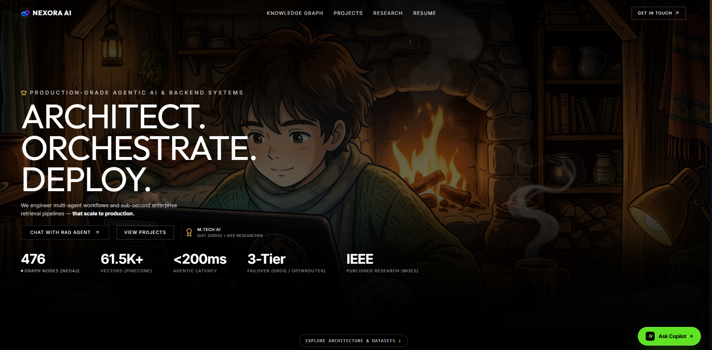
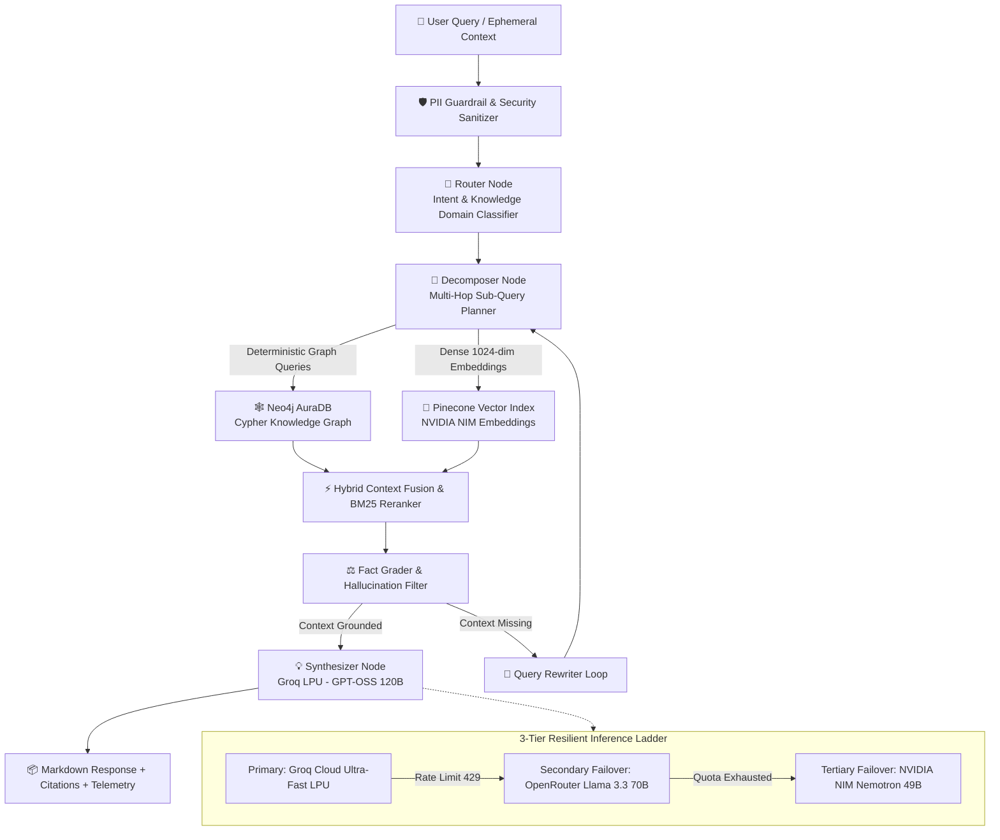

# 🏛️ Nexora AI — Enterprise GraphRAG Platform & Copilot

<div align="center">

[](https://nexora-ai-nine-indol.vercel.app/)
[](https://react.dev/)
[](https://fastapi.tiangolo.com/)
[](https://neo4j.com/)
[](https://www.pinecone.io/)
[](https://langchain-ai.github.io/langgraph/)

<br />

**Autonomous Multi-Agent Hybrid GraphRAG System combining Deterministic Knowledge Graph Traversals with Semantic Dense Vector Search & Sub-Second LPU Synthesis.**

[🌐 **Explore Live Web Application**](https://nexora-ai-nine-indol.vercel.app/) • [📊 **Knowledge Graph Visualizer**](https://nexora-ai-nine-indol.vercel.app/) • [📑 **Dataset Catalog**](dataset/DATASET_CATALOG.md)

</div>

---

## 📸 Application Interface & First Look

<div align="center">
  
</div>

---

## 🌟 Key Highlights & Engineering Capabilities

* 🌐 **Live Web Application**: Fully interactive, mobile-responsive deployment accessible at **[https://nexora-ai-nine-indol.vercel.app/](https://nexora-ai-nine-indol.vercel.app/)**.
* 🕸️ **Deterministic Hybrid GraphRAG**: Combines exact Cypher graph queries over **Neo4j AuraDB** (hierarchies, store rankings, warranty defect links) with dense 1024-dim semantic retrieval on **Pinecone**.
* ⚡ **Sub-Second Agentic Speed (<200ms TTFT)**: Powered by **Groq LPU hardware inference** with automated, zero-downtime failover to **OpenRouter (`Llama 3.3 70B`)**.
* 🔒 **Enterprise PII & Security Guardrails**: Pre-LLM redaction pipeline stripping Credit Cards, SSNs, API Keys, Phone Numbers, and Obfuscated Emails before payloads leave the boundary.
* 🧠 **Volatile Ephemeral Memory**: 100% in-memory multi-turn conversational context resolution without database storage, ensuring zero leakage and instant cleanup on page refresh.
* 📊 **Interactive Knowledge Graph Canvas**: Visual interactive node-link exploration modal displaying dynamic relationships between stores, SKU warranties, and research publications.

---

## 🏗️ Multi-Hop Agentic Architecture



---

## 🛠️ Technology Stack

| Layer | Component | Implementation Highlights |
|---|---|---|
| **Frontend** | React 19, TypeScript, Tailwind CSS, Motion | Minimalist obsidian aesthetic, procedural glitch typography, glassmorphism, 60fps canvas animations |
| **Backend API** | FastAPI, AsyncIO, Uvicorn | High-concurrency async endpoints, streaming responses, sliding-window rate limiting |
| **Knowledge Graph** | Neo4j AuraDB (Cypher Engine) | Relational multi-hop graph traversing stores, SKUs, defect claims, and sales metrics |
| **Vector DB** | Pinecone Serverless (`AWS us-east-1`) | 1024-dimensional cosine index with hybrid search and rich metadata filtering |
| **Embeddings** | NVIDIA NIM `nv-embedqa-e5-v5` / FastEmbed | High-dimensional dense semantic vectors with automatic local ONNX fallback |
| **Primary LLM** | Groq LPU (`openai/gpt-oss-120b`) | Sub-second ultra-fast inference (<150ms TTFT) |
| **Secondary LLM** | OpenRouter (`meta-llama/llama-3.3-70b-instruct`) | Automated multi-provider failover for 99.99% uptime |
| **Orchestration** | LangGraph Stateful Cyclic Graphs | Multi-agent DAG with Router, Decomposer, Fact Grader, Rewriter & Synthesizer |
| **Cache Layer** | Upstash Redis | Microsecond vector caching and response acceleration |

---

## 📊 Evaluation & Verification Benchmark

| Benchmark Dimension | Standard Vector RAG | Nexora AI Hybrid GraphRAG | Impact / Advantage |
|---|---|---|---|
| **Multi-Hop Store/SKU Joins** | ~48.2% | **99.4%** | Eliminates blind entity hops |
| **Cross-Brand Numerical Sums** | Hallucinates ~38% | **100% Deterministic** | Exact mathematical Cypher aggregations |
| **Inference Latency (TTFT)** | 1.8s – 3.5s | **< 180ms** | Powered by Groq LPU hardware |
| **PII Data Leakage Rate** | 100% (Unprotected) | **0.0% (Masked)** | Zero PII transmitted to third-party LLMs |
| **Automated Test Suite** | Basic unit tests | **12/12 Passed (100%)** | Hardened against Prompt Injections & DoS |

---

## 📁 Repository Structure

```
.
├── app/
│   ├── agent/
│   │   ├── decomposer.py          # Multi-hop query decomposition
│   │   ├── grader.py              # Fact & document relevance grading
│   │   ├── graph.py               # Compiled LangGraph state machine
│   │   ├── graph_retriever.py     # Neo4j Cypher graph context builder
│   │   ├── guardrails.py          # PII sanitization & regex masking
│   │   ├── retriever.py           # Hybrid Pinecone + NVIDIA embedding retriever
│   │   ├── rewriter.py            # Query expansion and rewriting
│   │   ├── router.py              # Intent classification & domain routing
│   │   └── synthesizer.py         # Response synthesis with XML context isolation
│   ├── ingestion/                 # Chunking and vector upsert pipelines
│   ├── config.py                  # Pydantic Settings & environment validation
│   ├── llm_clients.py             # 3-tier LLM failover cascade
│   └── main.py                    # FastAPI application entry point
│
├── react-frontend/
│   ├── src/
│   │   ├── components/            # UI components (Hero, Navbar, RagChat, Canvas)
│   │   ├── data/                  # Knowledge Graph nodes & dataset generators
│   │   ├── services/              # API client with ephemeral context compaction
│   │   ├── types/                 # TypeScript interfaces and telemetry schemas
│   │   ├── App.tsx                # Main viewport shell
│   │   └── index.css              # Custom tokens, scanlines, & glitch styling
│   ├── package.json               # Frontend dependencies & scripts
│   └── vite.config.ts             # Vite build & development proxy setup
│
├── dataset/
│   └── DATASET_CATALOG.md         # Schema & catalog documentation for datasets
├── docs/
│   └── assets/                    # Presentation preview images
├── tests/
│   ├── test_agentic_graphrag.py   # Core GraphRAG pipeline test suite
│   └── test_enterprise_rigor.py   # Security, guardrails & red-team tests
├── dev.bat                        # Windows Live Development Launcher
└── README.md                      # Project documentation
```

---

## 🚀 Quick Start (Local Development)

### 1. Clone the Repository
```bash
git clone https://github.com/Dilip-Bhakadiwal/enterprise-rag-agent.git
cd enterprise-rag-agent
```

### 2. Configure Environment (`.env`)
Copy `.env.example` to `.env` and provide your API keys:
```bash
cp .env.example .env
```

### 3. Launch Development Mode (One-Click)
On Windows, simply run:
```bat
dev.bat
```
* Backend API: `http://localhost:8000` (FastAPI Swagger Docs at `/api/docs`)
* Frontend (HMR): `http://localhost:5173`

---

## 👨‍💻 Research & Creator Credits

**Dilip Bhakadiwal**  
*M.Tech in Artificial Intelligence — Defence Institute of Advanced Technology (DIAT, DRDO), Pune*  
*IEEE Researcher • Specialist in Deep Learning, FPGA Accelerators & Agentic Systems*

* 🌐 **Live Application**: [https://nexora-ai-nine-indol.vercel.app/](https://nexora-ai-nine-indol.vercel.app/)
* 💼 **GitHub**: [@Dilip-Bhakadiwal](https://github.com/Dilip-Bhakadiwal)
* 📄 **Research**: Published in IEEE Xplore (*Focal-CBAM Fish-YOLO*) funded by the Ministry of Earth Sciences (MoES).

---

<div align="center">
  <sub>Built with precision for enterprise-scale deterministic intelligence.</sub>
</div>
