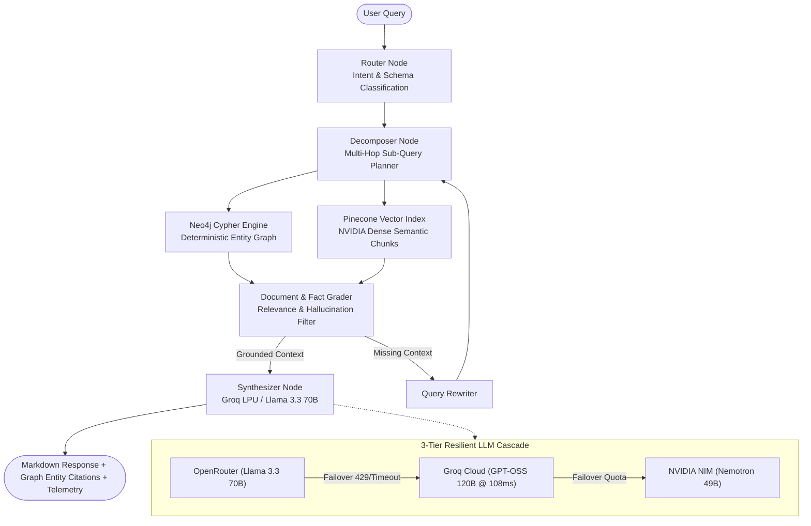

# 🏛️ Nexora AI — Enterprise GraphRAG Platform & Interactive Copilot

> **Production-Grade Enterprise GraphRAG System by Dilip Bhakadiwal**
> Autonomous multi-agent reasoning combining deterministic **Neo4j Knowledge Graph** traversals with semantic **Pinecone Vector Search** and **Groq LPU** sub-second synthesis over multi-modal enterprise telemetry (Apple retail performance, Samsung 5G regional sales, warranty claims) and Dilip Bhakadiwal's AI research knowledge base.

---

## 🚀 Key Highlights & Architectural Features



---

## 🛠️ Technology Stack

| Component | Technology | Highlights |
|---|---|---|
| **Frontend** | React 19, TypeScript, Tailwind CSS v4, Motion | Glassmorphic dark theme, procedural glitch typography, 60fps momentum carousels, responsive mobile sheets |
| **Backend API** | FastAPI (Python 3.11+), AsyncIO, Uvicorn | High-concurrency async endpoints serving both dynamic RAG APIs and static bundle |
| **Knowledge Graph** | Neo4j AuraDB (Cypher Query Engine) | Deterministic multi-hop entity relationships for retail, warranty, and market share |
| **Vector DB** | Pinecone Serverless (AWS `us-east-1`) | 1024-dim cosine index with hybrid search and rich metadata filtering |
| **Embedding Engine**| NVIDIA NIM `nvidia/nv-embedqa-e5-v5` | High-dimensional enterprise semantic retrieval embeddings |
| **LLM Tier 1** | OpenRouter (`meta-llama/llama-3.3-70b-instruct`) | Primary multi-agent reasoning and answer synthesis |
| **LLM Tier 2** | Groq Cloud (`openai/gpt-oss-120b`) | Ultra-fast secondary failover (<150ms TTFT) |
| **LLM Tier 3** | NVIDIA NIM (`nvidia/llama-3.3-nemotron-super-49b-v1`) | Resilient tertiary fallback |
| **Agent Core** | LangGraph Stateful Cyclic Graphs | Router, Multi-hop Decomposer, Fact Grader, Rewriter, Synthesizer |
| **Security** | Sliding Window Rate Limiting, XML Isolation | IP rate limiting (25 req/min), prompt injection isolation |

---

## 📁 Clean Repository Structure

```
.
├── app/
│   ├── agent/
│   │   ├── decomposer.py          # Multi-hop query decomposition
│   │   ├── grader.py              # Fact & document relevance grading
│   │   ├── graph.py               # Compiled LangGraph state machine
│   │   ├── rewriter.py            # Query expansion and rewriting
│   │   ├── router.py              # Intent classification & Cypher/Vector routing
│   │   └── synthesizer.py         # Response synthesis with XML context isolation
│   ├── ingestion/
│   │   ├── chunker.py             # Recursive token chunking
│   │   ├── embed_and_upsert.py    # Batch ingestion to Pinecone
│   │   └── load_dataset.py        # Enterprise dataset parser
│   ├── config.py                  # Central Pydantic Settings
│   ├── llm_clients.py             # 3-tier LLM failover cascade
│   └── main.py                    # FastAPI application entry point
│
├── react-frontend/
│   ├── public/                    # Assets (logo, video, PDF resume)
│   ├── src/
│   │   ├── assets/                # Bundled images & logos
│   │   ├── components/            # UI components (Hero, Navbar, RagChat, Modals)
│   │   ├── services/              # API client with AbortSignal & graceful fallbacks
│   │   ├── App.tsx                # Main application layout & shell
│   │   └── index.css              # Custom tokens, scanlines, & glitch CSS
│   ├── package.json               # Frontend dependencies & scripts
│   └── vite.config.ts             # Vite build & development proxy setup
│
├── scripts/
│   ├── fetch_langsmith_report.py  # LangSmith telemetry report generator
│   ├── generate_eval_questions.py # Benchmark evaluation question builder
│   ├── ingest_portfolio.py        # Portfolio vector ingestion
│   └── test_with_questions.py     # Batch evaluation runner
│
├── .dockerignore                  # Docker build exclusions
├── .gitignore                     # Git secret & cache exclusions
├── .env.example                   # Sanitized environment variable template
├── Dockerfile                     # Multi-stage production build (Node + Python)
├── requirements.txt               # Python dependencies
├── dev.bat                        # One-click Windows Live Development Launcher
├── start.bat                      # One-click Windows Production Launcher
└── README.md                      # Complete project documentation
```

---

## 🚀 Quick Start (Local Development)

### 1. Prerequisites
- Python 3.11+
- Node.js 20+

### 2. Configure Environment (`.env`)
Copy `.env.example` to `.env` and fill in your credentials:
```bash
cp .env.example .env
```

### 3. Launch Development Server (One Click)
Double-click **`dev.bat`** on Windows or run:
```bat
dev.bat
```
This automatically frees required ports, starts the FastAPI backend on `http://localhost:8000`, starts Vite with Live Reload on `http://localhost:5173`, and opens the app in your browser!

---

## ☁️ Production Deployment (Docker / Cloud)

The multi-stage **`Dockerfile`**:
1. **Stage 1 (Node.js)**: Compiles `react-frontend` into optimized static assets.
2. **Stage 2 (Python)**: Packages FastAPI and LangGraph dependencies, copies the static frontend bundle, and runs securely as a non-root `appuser`.

### Build & Run Container:
```bash
docker build -t nexora-ai-app .
docker run -p 8000:8000 --env-file .env nexora-ai-app
```
